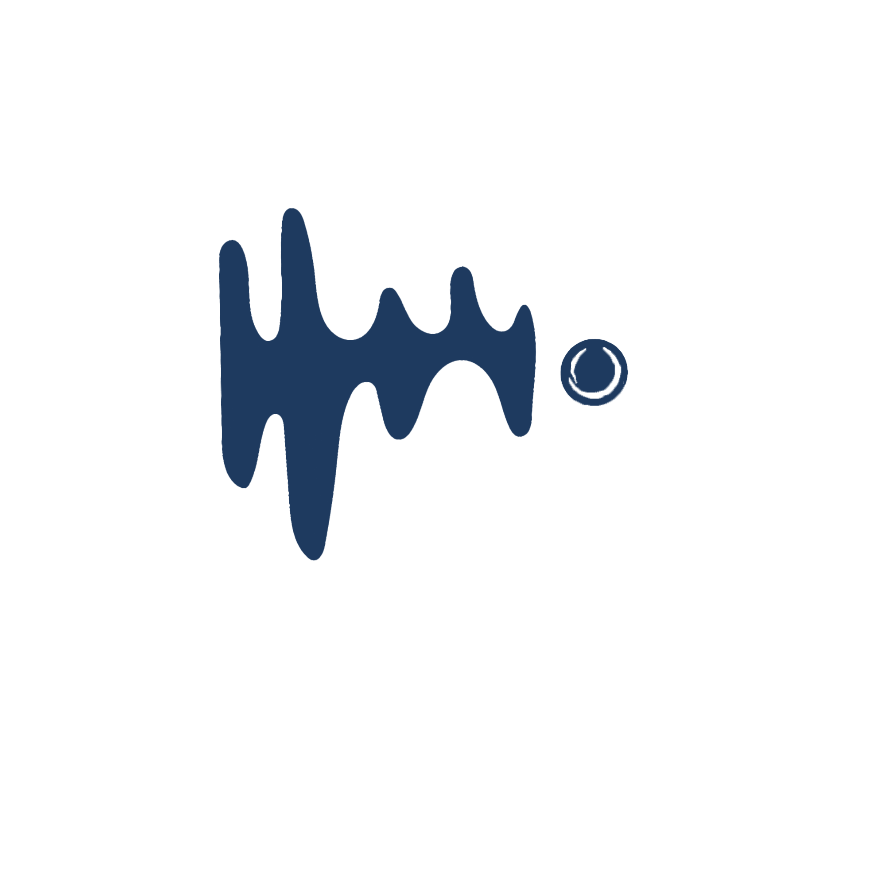

# 🏷️ HEAR ME OUT — Marka ve Kurumsal Kimlik

## 1. Marka Kimliği

| Alan | Bilgi |
|------|-------|
| **Marka Adı** | Hear Me Out |
| **Amaç** | İşaret dilini gerçek zamanlı olarak metne çevirerek iletişim bariyerlerini kaldırmak |
| **Vizyon** | Herkesin eşit şekilde anlaşılabildiği bir dünya |

### Değerler

| Değer | Anlamı |
|-------|--------|
| **Erişilebilirlik** | Herkes için kullanılabilir, engelsiz tasarım |
| **Sadelik** | Karmaşıklıktan uzak, anlaşılır arayüz |
| **Güven** | Kullanıcı verisi güvende, on-device gizlilik |
| **Teknoloji + İnsan Odağı** | Teknoloji araç, insan merkez |

---

## 2. Logo



---

## 3. Renk Paleti (Design System)

### Ana Renkler

| Renk | HEX | Kullanım | Hissiyat |
|------|-----|----------|----------|
| **Primary** | `#1E3A5F` | Ana butonlar, seçili tab'lar, AppBar | Lacivert — güven, teknoloji |
| **Secondary** | `#4DA8DA` | Vurgu, linkler, aktif göstergeler | Açık mavi — erişilebilirlik, sakinlik |
| **Soft Grey** | `#F2F4F7` | Light mode arka plan, kart arka planı | Hafif, temiz |
| **Mid Grey** | `#8A94A6` | İkincil metin, placeholder, ikonlar | Nötr, okunaklı |

### Dark Mode

| Renk | HEX | Kullanım |
|------|-----|----------|
| **Background** | `#0F172A` | Ana arka plan |
| **Card / Surface** | `#1E293B` | Kart, panel, modal arka planı |
| **Text Primary** | `#FFFFFF` | Ana metin |
| **Text Secondary** | `#8A94A6` | Alt metin, etiketler |

### Light Mode

| Renk | HEX | Kullanım |
|------|-----|----------|
| **Background** | `#F2F4F7` | Ana arka plan |
| **Card / Surface** | `#FFFFFF` | Kart arka planı |
| **Text Primary** | `#1E3A5F` | Ana metin (primary ile uyumlu) |
| **Text Secondary** | `#8A94A6` | Alt metin |

### Özel Renkler

| Renk | HEX | Kullanım |
|------|-----|----------|
| **Success** | `#22C55E` | Başarılı tanıma, confidence >80% |
| **Warning** | `#F59E0B` | Orta confidence, dikkat uyarısı |
| **Error / Emergency** | `#EF4444` | Hata, düşük confidence, acil durum butonu |

### Genel Hissiyat
> **"tech + calm + accessible"** — Teknolojik ama sakin, güven veren, herkes için erişilebilir.

---

## 4. Tipografi

| Stil | Font | Ağırlık | Boyut | Kullanım |
|------|------|---------|-------|----------|
| **H1** | Poppins | Bold | 28px | Ekran başlıkları |
| **H2** | Poppins | SemiBold | 22px | Bölüm başlıkları |
| **H3** | Poppins | SemiBold | 18px | Kart başlıkları |
| **Body** | Montserrat | Regular | 16px | Genel metin (minimum bu!) |
| **Body Medium** | Montserrat | Medium | 16px | Vurgulu gövde metin |
| **Body Small** | Montserrat | Regular | 14px | Alt açıklamalar |
| **Button** | Poppins | SemiBold | 16px | Buton metinleri |
| **Caption** | Montserrat | Regular | 12px | Tarihler, etiketler |

### Tipografi Kuralları
- ✅ **Minimum 16px** gövde metin (erişilebilirlik)
- ✅ Büyük puntolar tercih edilir
- ✅ **Yüksek kontrast** — metin/arka plan oranı WCAG AA standardında
- ✅ Başlıklarda **Poppins**, gövde metinde **Montserrat** — tutarlılık

---

## 5. UI Stil Kılavuzu

### Genel Prensipler
| Prensip | Uygulama |
|---------|----------|
| **Minimal & temiz** | Gereksiz eleman yok, beyaz alan bol |
| **Rounded corners** | Border radius: **16px** (tüm kartlar, butonlar) |
| **Flat design + hafif shadow** | Gölge var ama abartısız (elevation: 2-4) |
| **Büyük butonlar** | Min yükseklik 56px, erişilebilirlik için geniş dokunma alanı |
| **Icon + text birlikte** | Sadece ikon yetmez, yanında metin de olmal (anlaşılabilirlik) |

### Buton Stilleri

```
┌───────────────────────────────────────┐
│  Primary Button (Filled)              │
│  Background: #1E3A5F                  │
│  Text: #FFFFFF (Poppins SemiBold 16)  │
│  Height: 56px                         │
│  Radius: 16px                         │
│  Shadow: 0px 4px 12px rgba(0,0,0,0.1)│
└───────────────────────────────────────┘

┌───────────────────────────────────────┐
│  Secondary Button (Outlined)          │
│  Border: 2px solid #4DA8DA           │
│  Text: #4DA8DA                        │
│  Height: 56px                         │
│  Radius: 16px                         │
│  Background: transparent              │
└───────────────────────────────────────┘

┌───────────────────────────────────────┐
│  Emergency Button (Filled, Pulsing)   │
│  Background: #EF4444                  │
│  Text: #FFFFFF                        │
│  Height: 64px                         │
│  Radius: 16px                         │
│  Animation: Pulsing glow (1.5s loop)  │
└───────────────────────────────────────┘
```

### Kart Stili

```
┌───────────────────────────────────────┐
│  Card (Light Mode)                    │
│  Background: #FFFFFF                  │
│  Radius: 16px                         │
│  Shadow: 0px 2px 8px rgba(0,0,0,0.06)│
│  Padding: 16px                        │
│  Gap between cards: 12px              │
└───────────────────────────────────────┘

┌───────────────────────────────────────┐
│  Card (Dark Mode)                     │
│  Background: #1E293B                  │
│  Radius: 16px                         │
│  Border: 1px solid rgba(255,255,255,0.05) │
│  Shadow: none                         │
│  Padding: 16px                        │
└───────────────────────────────────────┘
```

### İkon Kullanımı
- **Stil**: Outlined (material icons outlined set)
- **Boyut**: 24px (normal), 32px (navigasyon), 48px (acil durum)
- **Renk**: Primary (#1E3A5F) veya Secondary (#4DA8DA)
- **Kural**: Her ikon yanında açıklayıcı metin olmalı (erişilebilirlik)

---

## 6. Flutter Tema Tanımı
