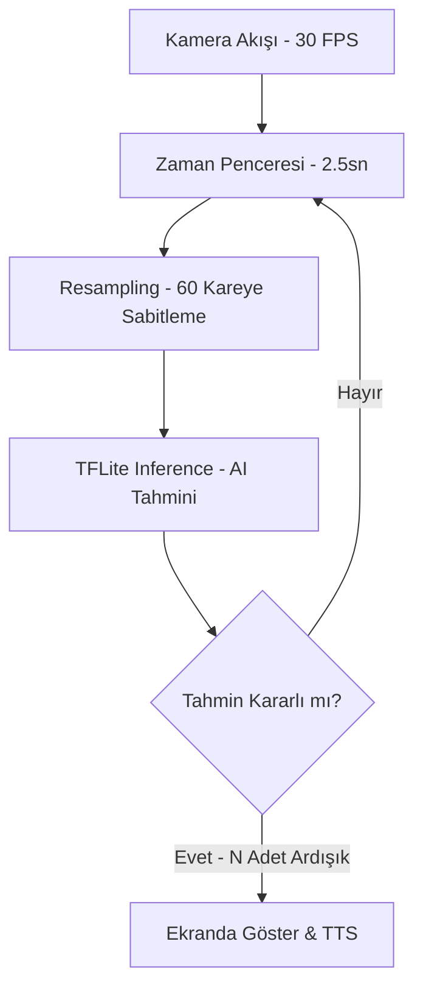

# İşaretten Metne AI Pipeline Mantığı

Bu doküman, "İşaretten Metne" modülünün kamera görüntüsünden kelime tahminine kadar geçen süreci nasıl yönettiğini detaylandırır.

## Temel Bileşenler

### 1. Kayan Pencere (Sliding Window)
Yapay zeka, anlık bir fotoğrafa değil, zaman içindeki bir sürece bakar. 
- **Pencere Süresi:** 2500ms (2.5 saniye).
- **Mantık:** Kamera saniyede 30 kare çekerken, sistem her zaman **en son 2.5 saniyeyi** hafızasında tutar. Yeni bir kare geldiğinde, en eski kare bellekten silinir.
- **Hedef:** 1.5 - 3 saniye arası süren işaret dili hareketlerini bütünsel olarak yakalamak.

### 2. Örnekleme ve Normalizasyon (Resampling)
AI modeli sadece **60 karelik** (fixed-length) girişleri kabul eder.
- **Problem:** Kullanıcının hareketi 1 saniye de sürebilir, 3 saniye de.
- **Çözüm:** 2.5 saniyelik ham veri, matematiksel olarak "yeniden örneklenir" (Resampling).
  - Eğer veri az ise esnetilir (Padding/Interpolation).
  - Eğer veri çok ise sıkıştırılır (Downsampling).
- **Normalizasyon:** El ve vücut noktaları (landmark), kameradaki ekrana göre değil, kendi içinde oranlanır. Bu sayede telefonun uzaklığı tanımayı etkilemez.

### 3. Kararlılık Eşiği (Stabilization / Debouncing)
AI her 150-200ms'de bir tahmin üretir. Ancak bu tahminler gürültülü (noisy) olabilir.
- **Mekanizma:** AI'nın bir kelimeyi ekrana yazması için o kelimeyi **ardışık N kez** (eşik değeri) doğrulaması gerekir.
- **Dinamik Eşik:**
  - **Düşük (3):** Çok hızlı tepki, yüksek hata payı.
  - **Orta (5):** İdeal denge (Varsayılan).
  - **Yüksek (10):** Çok kararlı, yavaş tepki (Hareketi uzun süre sabit tutmak gerekir).

## Akış Diyagramı

## Özet
Sistemin 3 saniyelik verileri 0.5 saniyede tanıyabilmesinin sebebi, hareketin tamamlanmasını beklemek yerine, **pencere içindeki örüntünün (pattern) yeterli güven seviyesine ulaşmasıdır.** 5 kez üst üste aynı onayı alan bir örüntü, kararlı kabul edilerek kullanıcıya sunulur.
